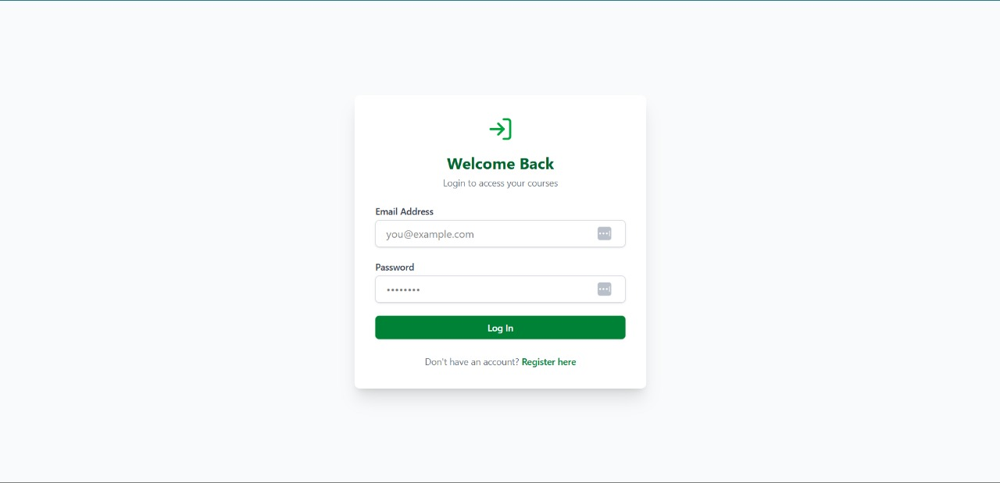

#  Coursify Frontend

**Coursify is a role-based online course platform frontend, built with **React** and **Tailwind CSS**, it  allows users to register, login, view courses, and instructors to manage learning content.  It connects seamlessly with a Flask backend for full-stack functionality.

## Screenshots

### Create Account

### Login Page

### Instructor Dashboard

### Instructor Course

### Available Courses (All Users)

### User Profile

### Enrolled Courses (Student View)

### Enrolled Students (Instructor View)

## Create Account (User Account)

## Create New Course(user course)

## Enrolled student(Enrollments)

## Technologies used included 

- **React.js**
- **Tailwind CSS**
- **React Router DOM**
- **Formik + Yup** 
- **JWT Auth** 
- **Lucide Icons**

## Key Features 

- **Role-based Authentication** 
- Instructors: Create and manage courses
- Students: Browse, enroll, and track progress
- Profile page with user details
- Reviews and progress tracking 

## Folder Structure

Coursify-frontend/

│ ├── components/ # Navbar, Forms, Cards, etc.
│ ├── pages/About.jsx, CourseDetails.jsx,Dashboard.jsx,InstrCourseDetails.jsx ,InstructorDashboard.jsx, InstructorProfile.jsx, LandingPage.jsx, Login.jsx, MyCourses.jsx, Register.jsx
│──src
│ ├── App.jsx 
│ └── main.jsx 
| └── index.css
| └──
├── screenshots
└── README.md

###  Clone the repo

git clone https://github.com/Chenzie2/Coursify-frontend
1. cd Coursify-frontend
2. Install dependencies

npm install
3. Start the development server

npm run dev
Ensure your Flask backend is running on http://127.0.0.1:5555
