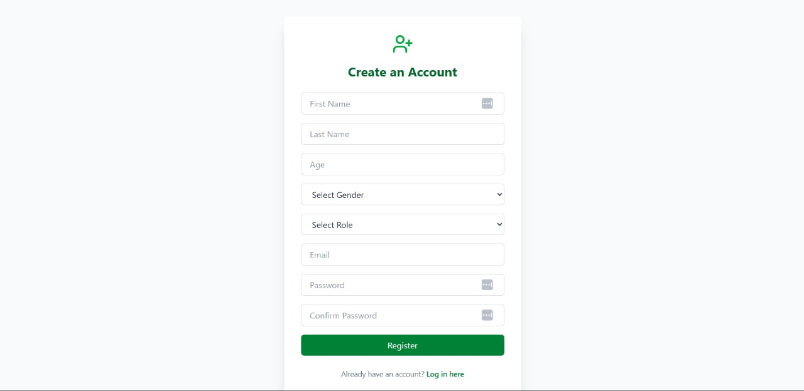

# Coursify Frontend

**Coursify** is a role-based online course platform frontend, built with **React** and **Tailwind CSS**.  
It allows users to register, log in, view courses, and enables instructors to manage learning content.  
It connects seamlessly with a Flask backend for full-stack functionality.

---

## 📸 Screenshots

| Feature | Screenshot |
|---------|------------|
| Create Account |  |
| Login Page |  |
| Instructor Dashboard |  |
| Instructor Course Details |  |
| Available Courses |  |
| User Profile |  |
| Enrolled Courses |  |
| Enrolled Students |  |
| Create New Course |  |

---

## 🛠 Technologies Used

- **Frontend**: React.js, Tailwind CSS
- **Routing**: React Router DOM
- **Forms**: Formik + Yup 
- **Auth**: JWT Authentication 
- **Icons**: Lucide Icons
- **Backend**: Flask (hosted on Render)

---

##  Key Features

- **Role-based Access**:
  - Instructors: Create/manage courses, view enrollments
  - Students: Browse/enroll in courses, track progress
- Responsive UI with Tailwind CSS
- Form validation with Formik & Yup
- Protected routes based on user role
- Profile management system

---

## Folder Structure
Coursify-frontend/
├── components/ # [CourseCard, Footer, Layout, Navbar]
├── pages/ # [About, CourseDetails, Dashboard, Home, Instr, Instructor, LandingPage, Login, MyCourses, Register]
├── public/ # Coursify.webp
├── screenshots/ # [.jpg screenshots]
├── src/ # [App.*, main.jsx, assets/, images/, index.css]
├── .gitignore
├── .config.js # [eslint, vite]
├── package.json # [package, package-lock]
├── Pipfile
└── README.md
---


## Setup Instructions

1. Clone the repository:
```bash
git clone https://github.com/Chenzie2/Coursify-frontend
cd Coursify-frontend
```

2. Install dependencies:
```bash
npm install
```

3. Start the development server:
```bash
npm run dev
```

- Ensure your backend is running at https://coursify-backend-svup.onrender.com/

